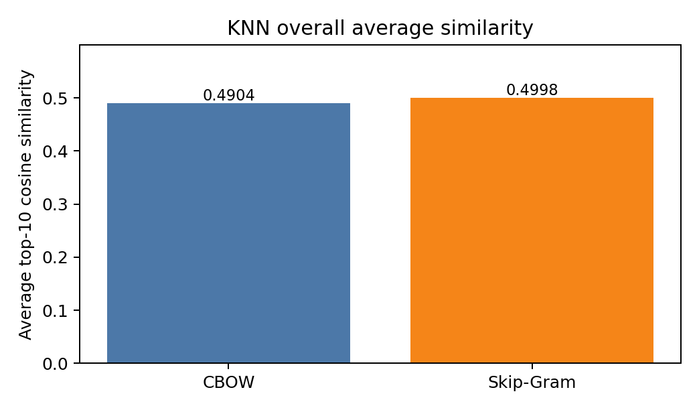
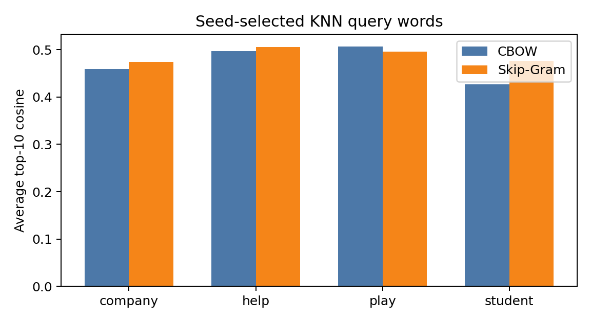
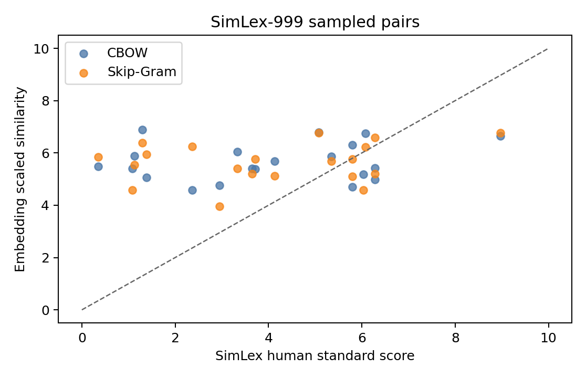
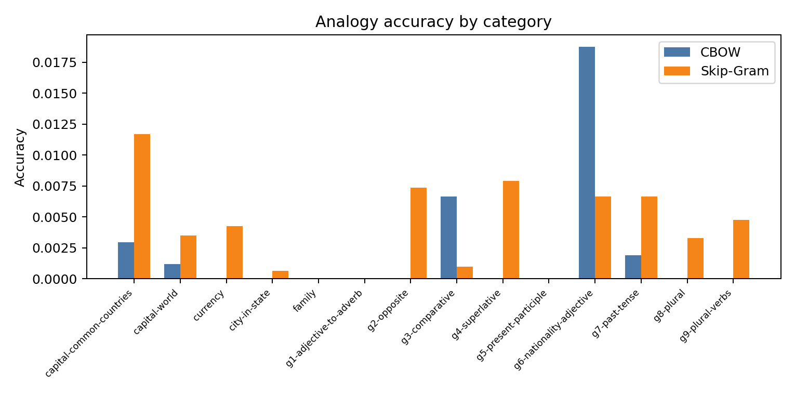
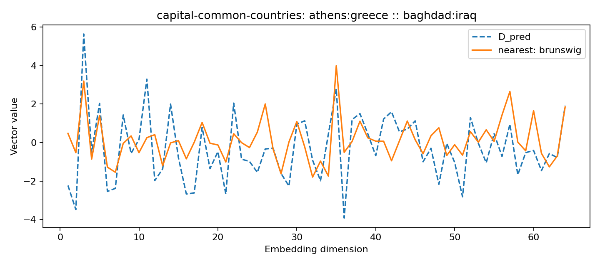
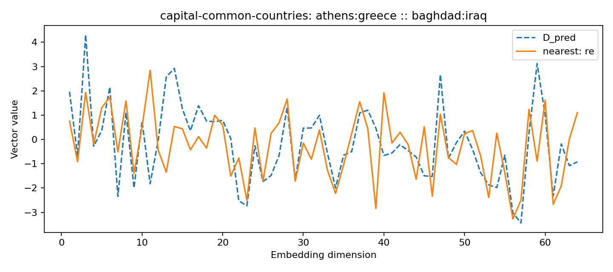
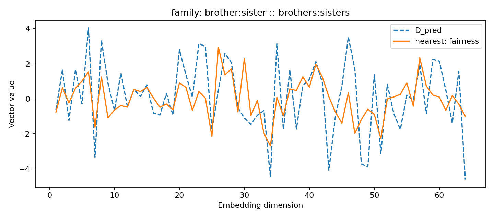
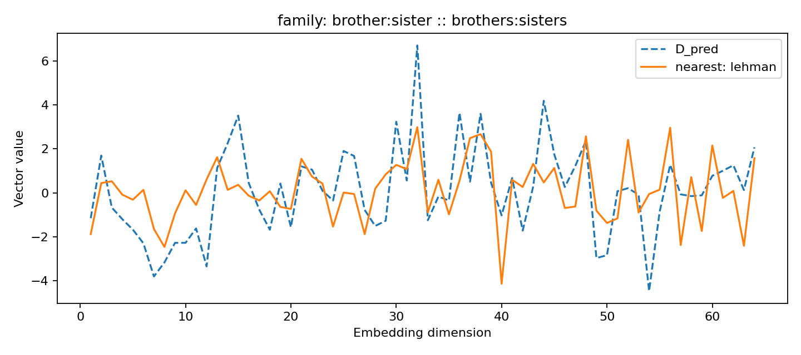

# CSC5010 Artificial Intelligence Project 1 and 2 Report

Student ID: 225040065

## Abstract

This report presents the training and evaluation of two Word2Vec models, Continuous Bag of Words (CBOW) and Skip-Gram, for CSC5010 Project 1 and 2. Both models are trained on the NLTK Reuters corpus and evaluated using three tasks: K-nearest neighbor similarity, SimLex-999 golden standard correlation, and analogical reasoning. The experiment is intentionally small and reproducible: the embedding dimension is 64, the context window is 2, the batch size is 1024, the optimizer is Adam with learning rate 0.001, and both models are trained for 10 epochs.

The main finding is that Skip-Gram is slightly stronger than CBOW on all three aggregate metrics in this run, but the difference is small. Both models learn useful local distributional similarity, while the SimLex and analogy scores reveal clear limitations caused by the small Reuters training corpus, narrow news/finance domain, and plain Word2Vec objective.

## 1. Task Definition and Dataset

The goal of this project is to train two word embedding models and evaluate whether the resulting word vectors capture semantic similarity and word relation structure. The two models answer complementary self-supervised questions. CBOW predicts a center word from surrounding context words, while Skip-Gram predicts surrounding context words from a center word. In both cases, no manually labeled training data is used for learning the vectors.

The training corpus is the Reuters corpus from NLTK. After preprocessing and lowercasing, the corpus contains 54,716 sentences and produces a vocabulary of 31,081 tokens. This corpus is appropriate for a compact experiment, but it is not a broad general-language corpus. Many documents are about markets, trade, companies, commodities, policy, and financial events. This domain bias matters in the evaluation because Word2Vec learns words that occur in similar contexts, not necessarily words that humans judge as synonyms.

The evaluation files are the assignment-provided 50 KNN query words, `simlex-999.txt`, and `analogical reasoning task.txt`. Random examples in this report are selected with my student ID, 225040065, so that the KNN detailed words, SimLex sample pairs, and analogy examples can be reproduced by running the scripts again with the same seed.

## 2. Model Training

| Model | Training objective | Vocabulary | Dimension | Context window | Epochs | Final loss | Output file |
|---|---|---:|---:|---:|---:|---:|---|
| CBOW | context -> center word | 31,081 | 64 | 2 | 10 | 6462.34 | `embeddings/cbow.vec` |
| Skip-Gram | center word -> context | 31,081 | 64 | 2 | 10 | 37952.81 | `embeddings/skipgram.vec` |

The two final loss values should not be directly compared as if they were the same measurement. CBOW creates one prediction target for each center position, while Skip-Gram creates multiple center-context pairs and therefore accumulates a larger training loss. Instead, the downstream evaluation tasks provide the meaningful comparison.

The trained vectors are saved in text `.vec` format. The first line records vocabulary size and embedding dimension, followed by one token and its vector per line. This format is used consistently by all evaluation scripts.

## 3. Evaluation Methodology

For KNN evaluation, cosine similarity is computed between each query word vector and every vocabulary vector. The query word itself is excluded, and the top 10 nearest neighbors are saved. Each query also receives an average top-10 cosine similarity, and the final KNN score is the average across all covered queries.

For the golden standard evaluation, each covered SimLex-999 pair is scored using cosine similarity. Because SimLex labels are in [0, 10] while cosine similarity is in [-1, 1], the model score is normalized by `scaled = (cosine + 1) * 5`. Spearman correlation is then computed between human standard scores and scaled embedding scores.

For analogical reasoning, each question has the form A:B :: C:D. The predicted vector is `embedding(B) - embedding(A) + embedding(C)`. The nearest vocabulary word to the predicted vector is searched by cosine similarity, excluding A, B, and C. A prediction is correct only if the nearest word exactly matches D.

## 4. K-Nearest Neighbor Evaluation

Both models cover 49 of the 50 required query words. CBOW obtains an overall average top-10 cosine similarity of 0.490364. Skip-Gram obtains 0.499827. The four student-ID-selected detailed words are **company, help, play, student**.

| Query | CBOW top-10 neighbors | Skip-Gram top-10 neighbors |
|---|---|---|
| company | titanic (0.504); capsized (0.495); simulations (0.479); ammar (0.453); tcb (0.449); davis (0.449); mereenie (0.441); separates (0.441); firm (0.440); sidelines (0.437) | anp (0.525); companies (0.496); jerome (0.487); ecofuel (0.481); thyssen (0.479); landslide (0.465); poreferred (0.458); pillsbury (0.451); azzam (0.450); outstandings (0.448) |
| help | dispense (0.567); maintain (0.553); achieve (0.518); continue (0.493); tonnage (0.482); slow (0.479); assistance (0.473); allow (0.471); sic (0.468); attributed (0.466) | elevated (0.526); assistance (0.524); dominate (0.511); solve (0.509); ease (0.506); progressively (0.506); curb (0.499); satisfy (0.495); bangkok (0.494); bottled (0.485) |
| play | find (0.547); develop (0.544); imperfections (0.535); recommend (0.514); interfere (0.511); accomplish (0.507); block (0.495); outspoken (0.475); require (0.471); dismantle (0.470) | deter (0.559); redressing (0.510); indexes (0.508); generalised (0.504); harbin (0.487); cope (0.485); noticeably (0.484); rational (0.483); protecionist (0.476); edinburgh (0.464) |
| student | moonie (0.456); cycles (0.453); federal (0.438); electorate (0.429); accomplish (0.427); ftse (0.421); mark (0.417); shutdown (0.409); philippines (0.409); establishes (0.407) | yearly (0.524); pace (0.503); principal (0.484); underlying (0.472); conduct (0.467); breakfast (0.466); indentifying (0.465); outlook (0.465); denaturable (0.462); dull (0.453) |

The KNN results show that both models learn distributional relatedness, but this relatedness is not always the same as human synonymy. For `company`, Skip-Gram retrieves `companies`, which is a strong morphological and semantic match, while CBOW retrieves `firm` but also several news-specific or noisy tokens. This suggests that Skip-Gram can preserve some local lexical regularities, but both models are affected by rare or domain-specific Reuters vocabulary.

For `help`, both models retrieve words related to support or intervention, such as `assistance`, `ease`, `solve`, and `maintain`. This is one of the more interpretable KNN cases. For `play`, the neighbors are more mixed. CBOW retrieves verbs such as `find`, `develop`, and `recommend`, while Skip-Gram retrieves words such as `deter` and `cope`; these are not synonyms, but they can occur in similar syntactic positions. For `student`, the neighbors are weak, which is reasonable because Reuters is not education-centered, so the model sees fewer clean contexts for this word.

Overall, the KNN task gives the most favorable view of the embeddings because it measures local neighborhood coherence. Even when the neighbors are not exact synonyms, many of them share part of speech, topic, or usage context. Skip-Gram is slightly higher numerically, but the practical difference is modest.

## 5. SimLex-999 Golden Standard Evaluation

Out of 999 SimLex-999 word pairs, 680 pairs are covered by the learned vocabulary. CBOW obtains Spearman correlation 0.055747; Skip-Gram obtains 0.058087. These correlations are low, which means the ranking induced by the embedding similarities does not align strongly with human semantic similarity judgments.

| Model | Covered pairs | Spearman correlation | Interpretation |
|---|---:|---:|---|
| CBOW | 680 / 999 | 0.055747 | weak positive alignment |
| Skip-Gram | 680 / 999 | 0.058087 | slightly better weak alignment |

| Pair | Standard | CBOW scaled | Skip-Gram scaled | Comment |
|---|---:|---:|---:|---|
| bad-great | 0.35 | 5.49 | 5.85 | models overestimate the relation, likely because topical context is being learned |
| essential-necessary | 8.97 | 6.65 | 6.76 | model scores move in the expected high-similarity direction |
| water-salt | 1.30 | 6.89 | 6.38 | models overestimate the relation, likely because topical context is being learned |
| boat-car | 2.37 | 4.57 | 6.24 | the two architectures disagree moderately on this pair |
| house-carpet | 1.38 | 5.07 | 5.95 | models overestimate the relation, likely because topical context is being learned |
| intelligence-skill | 5.35 | 5.86 | 5.68 | both models behave similarly on this pair |
| whiskey-gin | 6.28 | 4.99 | 5.20 | both models behave similarly on this pair |
| comfort-safety | 5.80 | 6.30 | 5.76 | the two architectures disagree moderately on this pair |
| pipe-cigar | 6.03 | 5.19 | 4.57 | the two architectures disagree moderately on this pair |
| muscle-bone | 3.65 | 5.40 | 5.20 | both models behave similarly on this pair |
| night-dawn | 2.95 | 4.76 | 3.96 | the two architectures disagree moderately on this pair |
| fee-salary | 3.72 | 5.39 | 5.77 | both models behave similarly on this pair |
| jail-choice | 1.08 | 5.41 | 4.58 | the two architectures disagree moderately on this pair |
| steal-buy | 1.13 | 5.88 | 5.55 | models overestimate the relation, likely because topical context is being learned |
| deserve-earn | 5.80 | 4.71 | 5.11 | the two architectures disagree moderately on this pair |
| appear-attend | 6.28 | 5.43 | 6.60 | model scores move in the expected high-similarity direction |
| fail-discourage | 3.33 | 6.04 | 5.40 | the two architectures disagree moderately on this pair |
| agree-please | 4.13 | 5.69 | 5.12 | the two architectures disagree moderately on this pair |
| get-buy | 5.08 | 6.78 | 6.77 | both models behave similarly on this pair |
| attend-arrive | 6.08 | 6.74 | 6.22 | model scores move in the expected high-similarity direction |

The scatter plot makes the weakness visible: many points lie around the middle of the model-score range instead of following the diagonal. For example, `water-salt` has a low human score of 1.30 but receives a CBOW scaled score of 6.89. This kind of error is understandable in a Reuters corpus, where commodities and physical objects may appear in related news contexts even when they are not semantically similar in the SimLex sense.

There are also pairs where the embedding model behaves more reasonably. Both models assign higher scores to `essential-necessary`, `get-buy`, and `attend-arrive`. These cases show that the embeddings do capture some semantic regularity, but the signal is not consistent enough to produce a high global rank correlation. Skip-Gram is slightly better, but the difference is too small to claim a large advantage.

## 6. Analogical Reasoning Evaluation

The analogy dataset is much harder than KNN or SimLex because it requires vector offsets to represent stable relationships. Both models cover 8,591 analogy questions where all four words are present in the vocabulary. CBOW answers 28 questions correctly, and Skip-Gram answers 31 correctly.

| Model | Covered questions | Correct | Accuracy |
|---|---:|---:|---:|
| CBOW | 8591 | 28 | 0.003259 |
| Skip-Gram | 8591 | 31 | 0.003608 |

| Category | CBOW correct / covered | CBOW acc. | Skip-Gram correct / covered | Skip-Gram acc. |
|---|---:|---:|---:|---:|
| capital-common-countries | 1/342 | 0.0029 | 4/342 | 0.0117 |
| capital-world | 1/863 | 0.0012 | 3/863 | 0.0035 |
| currency | 0/236 | 0.0000 | 1/236 | 0.0042 |
| city-in-state | 0/1630 | 0.0000 | 1/1630 | 0.0006 |
| family | 0/20 | 0.0000 | 0/20 | 0.0000 |
| gram1-adjective-to-adverb | 0/552 | 0.0000 | 0/552 | 0.0000 |
| gram2-opposite | 0/272 | 0.0000 | 2/272 | 0.0074 |
| gram3-comparative | 7/1056 | 0.0066 | 1/1056 | 0.0009 |
| gram4-superlative | 0/380 | 0.0000 | 3/380 | 0.0079 |
| gram5-present-participle | 0/552 | 0.0000 | 0/552 | 0.0000 |
| gram6-nationality-adjective | 17/906 | 0.0188 | 6/906 | 0.0066 |
| gram7-past-tense | 2/1056 | 0.0019 | 7/1056 | 0.0066 |
| gram8-plural | 0/306 | 0.0000 | 1/306 | 0.0033 |
| gram9-plural-verbs | 0/420 | 0.0000 | 2/420 | 0.0048 |

The category table shows that most analogy categories have near-zero accuracy. CBOW performs best on `gram6-nationality-adjective`, while Skip-Gram spreads its few correct answers across more categories. However, the absolute numbers are still very low. This result suggests that the learned embedding space is not organized enough for exact relation arithmetic.

| Category | Analogy | Expected | CBOW predicted | Skip-Gram predicted |
|---|---|---|---|---|
| capital-world | canberra:australia :: lisbon:? | portugal | bbdo | regency |
| city-in-state | amarillo:texas :: phoenix:? | arizona | filter | canbra |
| gram1-adjective-to-adverb | apparent:apparently :: sudden:? | suddenly | rostam | condtions |
| gram3-comparative | new:newer :: wide:? | wider | mssl | unsubsidised |
| gram4-superlative | easy:easiest :: slow:? | slowest | moderate | attests |
| gram5-present-participle | slow:slowing :: play:? | playing | unauthorized | plenty |
| gram6-nationality-adjective | russia:russian :: thailand:? | thai | concessional | saleable |
| gram6-nationality-adjective | thailand:thai :: sweden:? | swedish | raw | freeport |
| gram7-past-tense | enhancing:enhanced :: describing:? | described | performances | kerridge |
| gram7-past-tense | knowing:knew :: running:? | ran | concerned | convert |

Most sampled analogy predictions are not close to the expected answers. For instance, geographic and grammatical questions often return unrelated Reuters vocabulary. This is a stronger failure than the SimLex result because analogy reasoning depends on the geometry of differences between vectors, not only local similarity. A small domain-specific corpus can learn that words are nearby, but it may not learn that many word pairs share the same offset direction.

### Vector Plot Examples

The vector plots compare the predicted vector with the nearest searched word vector across the 64 embedding dimensions. Even when the line shapes look partially aligned, the nearest word can still be semantically wrong. This is because the nearest-neighbor search is sensitive to the entire high-dimensional geometry, and a visually similar 64-dimensional curve does not guarantee that the expected analogy answer is the nearest vocabulary item.

## 7. Overall Comparison and Discussion

Across the three tasks, Skip-Gram is consistently but only slightly stronger. Its KNN average is 0.499827 compared with CBOW's 0.490364. Its SimLex Spearman correlation is 0.058087 compared with CBOW's 0.055747. Its analogy accuracy is 0.003608 compared with CBOW's 0.003259. The consistency is meaningful, but the margin is not large.

The results match the expected behavior of Word2Vec on a compact corpus. KNN evaluation is relatively forgiving because it asks whether nearby words are contextually related. SimLex is stricter because it compares model similarities against human lexical similarity. Analogy reasoning is strictest because it requires relational directions such as country-capital, adjective-adverb, comparative, superlative, and plural transformations to be linearly encoded in the vector space.

The main limitation is not that the implementation failed; the models trained correctly and produced valid embeddings. The limitation is that a 64-dimensional Word2Vec model trained for 10 epochs on Reuters does not have enough broad linguistic evidence to solve the hardest semantic tasks well. A larger corpus such as Wikipedia or Common Crawl, more training time, better handling of rare tokens, negative sampling, and hyperparameter tuning would likely improve the golden standard and analogy results.

## 8. Conclusion

This project successfully trained and evaluated CBOW and Skip-Gram embeddings. The KNN results show that both models learn meaningful local distributional neighborhoods. The SimLex results show weak alignment with human semantic similarity, and the analogy results show that the learned vector space does not reliably preserve exact relational offsets. Skip-Gram is the better model in this run, but the improvement over CBOW is small.

In conclusion, the experiment demonstrates both the strength and the limitation of simple Word2Vec. It is effective at learning contextual similarity from unlabeled text, but robust semantic similarity and analogy reasoning require broader data, stronger objectives, and more careful tuning than this compact assignment setup provides.