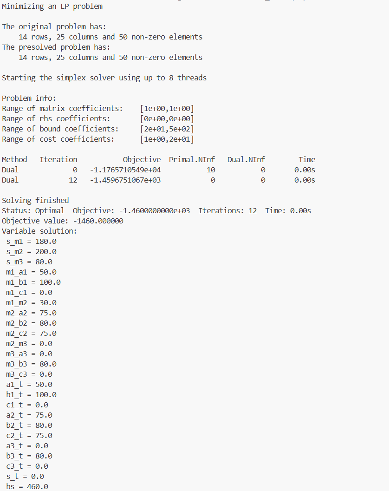

<p align='center'><b>DDA 5002 Optimization Fall 2025
<p align='center'>Homework # 1
<p align='center'>Student ID: 225040065

##### Question 1

(a)

$x_1: \text{number of the product of the first type produced per day}$

$x_2: \text{number of the product of the second type produced per day}$

$\text{objective function:}$
$$
\max(7.8x_1 + 7.1x_2)
$$
$\text{constraints:}$
$$
\frac{1}{4}x_1 + \frac{1}{3}x_2 \le 90 \\
\frac{1}{8}x_1 + \frac{1}{3}x_2 \le 80 \\
x_1, x_2 \ge 0
$$

(b)

(i) **can** be easily incorporated into the linear program formulation, while (ii) **cannot**. 

**for (i) modification (Linear Program Formulation)**

$x_1: \text{number of the product of the first type produced per day}$

$x_2: \text{number of the product of the second type produced per day}$

$h: \text{number of hours of overtime assembly labor per day}$

$\text{objective function:}$
$$
\max(7.8x_1 + 7.1x_2 - 7h) \\
s.t. \quad \frac{1}{4}x_1 + \frac{1}{3}x_2 \le 90 + h \\
\frac{1}{8}x_1 + \frac{1}{3}x_2 \le 80 \\
h \le 50 \\
x_1, x_2, h \ge 0 \\
x_1, x_2, h \in \Z
$$
**for (ii) modification**

$x_1: \text{number of the product of the first type produced per day}$

$x_2: \text{number of the product of the second type produced per day}$

$\text{objective function:}$
$$
\max(7.8x_1 + 7.1x_2 - \mathbb{1}\{7.8x_1 + 7.1x_2 > 300\}(0.12x_1 + 0.09x_2))
$$
$\text{constraints:}$
$$
\frac{1}{4}x_1 + \frac{1}{3}x_2 \le 90 \\
\frac{1}{8}x_1 + \frac{1}{3}x_2 \le 80 \\
x_1, x_2\ge 0 \\
x_1, x_2, h \in \Z
$$


##### Question 2

(a)

$p_k: \text{daily power consume of the k-th car, and we have: } p_1 = 10, p_2 = 8, p_3 = 13, p_4 = 15, p_5 = 9$

$d_k: \text{total mileage traveled of the k-th car, and we have: } d_1 = 60, d_2 = 55, d_3 = 75, d_4 = 80, d_5 = 64$

$m, b: \text{linear program parameters}$

$\text{objective function:}$
$$
\min(\Sigma^{5}_{k=1}y_k)
$$
$\text{constraints:}$
$$
- y_k \le d_k - (mp_k + b) \le y_k,\quad k = 1, 2, 3, 4, 5 \\
m, b, y_k\ge 0, \quad k = 1, 2, 3, 4, 5
$$

(b)

code and output:

```python
import coptpy as cp
from coptpy import COPT

# Create COPT environment
env = cp.Envr()

# Create COPT model
model = env.createModel("q2")

# Add variables
m = model.addVar(lb=0, name="m")
b = model.addVar(lb=0, name="b")
y = [model.addVar(lb=0, name=f"y_{i}") for i in range(5)]

p = [10, 8, 13, 15, 9]
d = [60, 55, 75, 80, 64]

# Add constraints
for i in range(5):
    model.addConstr(d[i] - (m * p[i] + b) <= y[i])
    model.addConstr(d[i] - (m * p[i] + b) >= -y[i])

# Set objective function
model.setObjective(sum(y), sense=COPT.MINIMIZE)

# Set parameter
model.setParam(COPT.Param.TimeLimit, 10.0)

# Solve the model
model.solve()

# Analyze solution
if model.status == COPT.OPTIMAL:
    print(f"Objective value: {model.objval:.6f}")
    print(f"Variable solution: m = {m.x:.4f}, b = {b.x:.4f}")
```


report:

Based on the data, we found that for every 1 unit increase in power consumption, the driving distance increases by an average of 4.5 miles. This model can fit the observed data well because it minimizes the sum of absolute errors between the predicted and actual values.

##### Question 3

$\text{period: } t = 1, 2,\cdots, T$

$\text{plant: } p = 1, 2,\cdots, P$

$\text{outlet: } o = 1, 2,\cdots, O$

$x_{t,p}: \text{number of plant } p \text{ manufatured in period } t$

$m_{t,p}: \text{cost of manufaturing plant } p \text{ in period } t$

$y_{t,p,o}: \text{number of plant } p \text{ shipped to outlet } o \text{ in period } t$

$c_{p,o}: \text{cost of shipping plant } p \text{ to outlet } o \text{ in period } t$

$z_{t,o}: \text{number of plant sold to outlet } o \text{ in period } t$

$r_{t,o}: \text{price of selling plant to outlet } o \text{ in period } t$

$s_{t,p}: \text{number of plant } p \text{ stored in period } t$

$h_{p}: \text{cost of storing plant } p \text{ in period } t$

$X_{t,p}: \text{the max number of plant } p \text{ manufatured in period } t$

$Z_{t,o}: \text{the max number of plant } p \text{ sold to outlet } o$

$S: \text{the max number of plant stored}$

$\text{objective function:}$
$$
\min(\Sigma^{T}_{t=1}\Sigma^{O}_{o=1}r_{t,o}z_{t,o} - \Sigma^{T}_{t=1}\Sigma^{P}_{p=1}m_{t,p}x_{t,p} - \Sigma^{T}_{t=1}\Sigma^{P}_{p=1}\Sigma^{O}_{o=1}c_{p,o}y_{t,p,o} - \Sigma^{T}_{t=1}\Sigma^{P}_{p=1}h_{p}s_{t,p})
$$
$\text{constraints:}$
$$
x_{t,p} + s_{t-1,p} = \Sigma^{O}_{o=1}y_{t,p,o} + s_{t,p} \\
\Sigma^{P}_{p=1}y_{t,p,o} \ge z_{t,o} \\
x_{t,p} \le X_{t,p} \\
z_{t,o} \le Z_{t,o} \\
s_{t,p} \le S \\
x_{t,p}, y_{t,p,o}, z_{t,o}, s_{t,p} \ge 0 \\
x_{t,p}, y_{t,p,o}, z_{t,o}, s_{t,p} \in \Z
$$


##### Question 4

(a)


(b)

$\text{as the diagram above, for each edge}_{i,j}\text{ we have } (c_{i,j}, u_{i,j})$

$x_{i,j}: \text{number of the units from } i \text{ to } j$

$c_{i,j}: \text{cost of the flow from } i \text{ to } j \text{ per unit}$

$u_{i,j}: \text{max units of the flow from } i \text{ to } j$

$b_{i}: \text{supply for node } i$

$\text{objective function:}$
$$
\min(\Sigma_{i,j\in A}c_{i,j}x_{i,j})
$$
$\text{constraints:}$
$$
\Sigma_{k\in IN(i)}x_{k,i} + b_{i} = \Sigma_{j\in OUT(i)}x_{i,j}, \quad \forall i\in A \\
0 \le x_{i,j} \le u_{i,j}, \quad \forall i,j\in A \\
b_i=\begin{cases}
b_s, & i = s, \\
-b_s, & i = t, \\
0, & i \ne s, t.
\end{cases}
$$

(c)

codes:

```python
import coptpy as cp
from coptpy import COPT

# Create COPT environment
env = cp.Envr()

# Create COPT model
model = env.createModel("q2")

# Add variables
vertex = ["s", "m1", "m2", "m3", "a1", "b1", "c1", "a2", "b2", "c2", "a3", "b3", "c3","t"]
edge = dict()
for v in vertex:
    edge[v] = dict()
edge["s"]["m1"] = [8, model.addVar(lb=0, ub=180, name="s_m1")]
edge["s"]["m2"] = [10, model.addVar(lb=0, ub=200, name="s_m2")]
edge["s"]["m3"] = [11, model.addVar(lb=0, ub=150, name="s_m3")]
edge["m1"]["a1"] = [4, model.addVar(lb=0, name="m1_a1")]
edge["m1"]["b1"] = [6, model.addVar(lb=0, name="m1_b1")]
edge["m1"]["c1"] = [8, model.addVar(lb=0, name="m1_c1")]
edge["m1"]["m2"] = [1, model.addVar(lb=0, ub=100, name="m1_m2")]
edge["m2"]["a2"] = [4, model.addVar(lb=0, name="m2_a2")]
edge["m2"]["b2"] = [6, model.addVar(lb=0, name="m2_b2")]
edge["m2"]["c2"] = [8, model.addVar(lb=0, name="m2_c2")]
edge["m2"]["m3"] = [1, model.addVar(lb=0, ub=100, name="m2_m3")]
edge["m3"]["a3"] = [4, model.addVar(lb=0, name="m3_a3")]
edge["m3"]["b3"] = [6, model.addVar(lb=0, name="m3_b3")]
edge["m3"]["c3"] = [8, model.addVar(lb=0, name="m3_c3")]
edge["a1"]["t"] = [-15, model.addVar(lb=0, ub=50, name="a1_t")]
edge["b1"]["t"] = [-20, model.addVar(lb=0, ub=100, name="b1_t")]
edge["c1"]["t"] = [-13, model.addVar(lb=0, ub=75, name="c1_t")]
edge["a2"]["t"] = [-19, model.addVar(lb=0, ub=75, name="a2_t")]
edge["b2"]["t"] = [-16, model.addVar(lb=0, ub=150, name="b2_t")]
edge["c2"]["t"] = [-21, model.addVar(lb=0, ub=75, name="c2_t")]
edge["a3"]["t"] = [-15, model.addVar(lb=0, ub=20, name="a3_t")]
edge["b3"]["t"] = [-18, model.addVar(lb=0, ub=80, name="b3_t")]
edge["c3"]["t"] = [-18, model.addVar(lb=0, ub=50, name="c3_t")]
edge["s"]["t"] = [0, model.addVar(lb=0, name="s_t")]

bs = model.addVar(lb=0, ub=530, name="bs")

# Add constraints
for v in vertex:
    model.addConstr(sum(edge[v][j][1] for j in vertex if j in edge[v]) - sum(edge[i][v][1] for i in vertex if v in edge[i]) == (bs if v == "s" else -bs if v == "t" else 0))

# Set objective function
model.setObjective(sum(edge[v1][v2][0] * edge[v1][v2][1] for v1 in vertex for v2 in vertex if v2 in edge[v1]), sense=COPT.MINIMIZE)

# Set parameter
model.setParam(COPT.Param.TimeLimit, 10.0)

# Solve the model
model.solve()

# Analyze solution
if model.status == COPT.OPTIMAL:
    print(f"Objective value: {model.objval:.6f}")
    allvars = model.getVars()
    print("Variable solution:")
    for var in allvars:
        print(f" {var.name} = {var.x}")
```



report:

The maximum profit is $1460. The plan is to produce 180 units of plants during period 1 and sell 50 units at outlet A, sell 100 units at outlet B, and store 30 units; Produce 200 units of plants during period 2 and sell 75 units at outlet A, 80 units at outlet B, and 75 units at outlet C; Produce 80 units of plants during period 3 and sell 80 units at outlet B.


##### Question 5

$\text{objective function:}$
$$
\min(\Sigma^{23}_{t=0}c_{t}x_{t})
$$
$\text{constraints:}$
$$
x_{t} = \Sigma^{t+5}_{t}y_{t,(i\ mod\ 24)},\quad t = 0, 1, \cdots, 23 \\
\Sigma^{t}_{k=t-8}x_{k\ mod\ 24} - \Sigma^{t-3}_{k=t-5}y_{k\ mod\ 24,t} \ge r_t,\quad t = 0, 1, \cdots, 23 \\
x_{t} \ge 0,\quad t = 0, 1, \cdots, 23
$$


