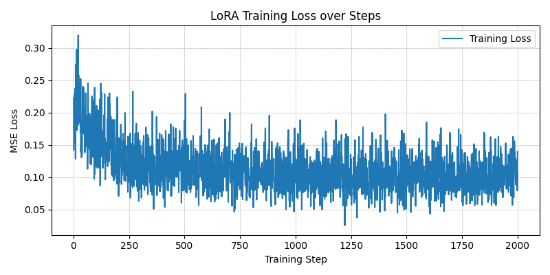
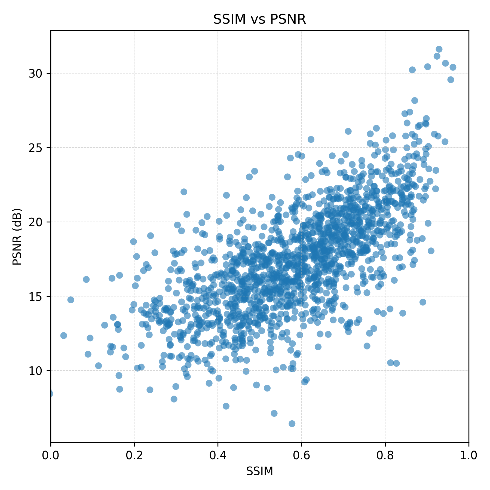
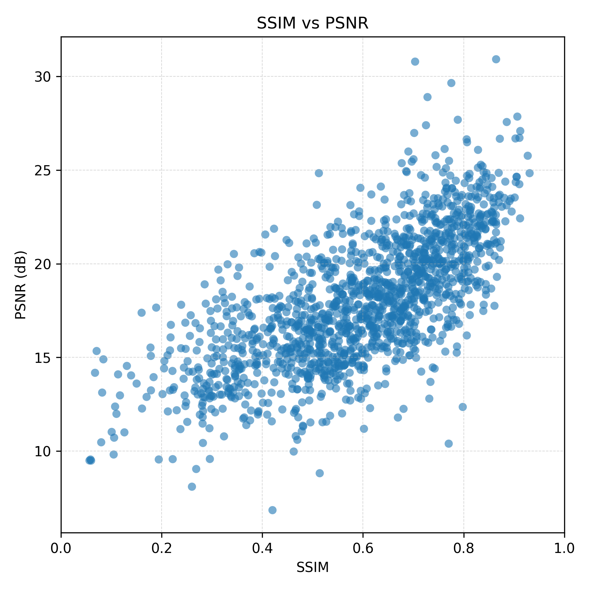

# InstructPix2Pix LoRA Video Forecasting

This project fine-tunes the Stable Diffusion InstructPix2Pix pipeline with LoRA adapters to predict the next frame of 12 fps action clips (Something-Something V2). The workflow covers preprocessing raw webm files, training LoRA adapters, and evaluating the fine-tuned pipeline with SSIM/PSNR plus scatter-plot visualization.

## Repository Layout

```
autodl-tmp/
├── code/
│   ├── dataset.py                # Datasets for train/eval splits
│   ├── preprocess_data.py        # Frame extraction + metadata selection
│   ├── train.py                  # LoRA fine-tuning script
│   ├── eval.py                   # Batched evaluation with metrics/plots
│   ├── run_train.sh              # Convenience launcher for training
│   └── run_eval.sh               # Convenience launcher for evaluation
├── data/
│   ├── 20bn-something-something-v2/  # Raw .webm clips (download separately)
│   ├── labels/                       # JSON metadata (train.json, etc.)
│   └── processed_dataset/            # Generated frames + metadata
├── requirements.txt
└── README.md
```

> Note: `code/run_train.sh` and `code/run_eval.sh` expect to be launched from the `code/` directory (see instructions below).

## Setup

```bash
cd /root/autodl-tmp
pip install -r requirements.txt
```

Ensure raw Something-Something V2 videos and label JSONs are already placed under `data/20bn-something-something-v2/` and `data/labels/` respectively.

## Execution Order & Tunable Hyperparameters

Always follow the sequence below so that each stage finds the artifacts generated by the previous one.

### 1. Preprocess (`preprocess.py`)

Run from the repo root:

```bash
python code/preprocess_data.py
```

Key knobs to adjust inside `preprocess_data.py`:

1. `target_classes_dict`: map of label templates to folder names (change to target other actions).
2. `videos_per_class`: number of videos sampled per class (default 500).
3. `extract_frames_from_video(..., num_frames=21)`: alter frame count or resize resolution (currently 96×96) if you want longer clips or different image sizes.

Outputs land in `data/processed_dataset/` with per-class folders, frame JPGs, and metadata.

### 2. Train (`run_train.sh`)

From `code/` run:

```bash
cd code
sh run_train.sh
```

Adjust the following arguments in `run_train.sh` / `train.py` as needed:

1. `--max-train-steps`: training duration (e.g., raise beyond 2000 for more iterations).
2. `--learning-rate`: optimizer step size (default `3e-5`).
3. `--lora-rank` / `--lora-alpha`: LoRA capacity; higher values increase expressiveness at the cost of memory.

Checkpoints are saved under `code/pix2pix-lora-run/lora-step-XXXX/` and the loss curve is written to `code/training_loss.png`.

### 3. Evaluate (`run_eval.sh`)

Still inside `code/` (or after re-entering it):

```bash
sh run_eval.sh
```

Important evaluation parameters inside `run_eval.sh` / `eval.py`:

1. `--lora-weights`: choose which `lora-step-XXXX` folder to load (match training run).
2. `--image-size` / `--pipe-resolution`: control dataset resize and pipeline resolution for inference.
3. `--eval-batch-size` / `--num-workers`: tune throughput vs. memory usage.

Evaluation produces:

- `eval_outputs/use_lora` or `eval_outputs/origin`: saved triplets (if `--save-images`) plus `ssim_psnr_scatter.png`.
- Console summary with average SSIM/PSNR across the dataset.

## Tips

- Set `HF_ENDPOINT=https://hf-mirror.com` (as done in the provided shell scripts) when accessing Hugging Face from restricted regions.
- Use `--no-use-lora` during evaluation to compare the base model vs. the fine-tuned adapter using the same command.

## Results

- Hardware: NVIDIA RTX 5090 32GB (single GPU)
- Training time: ~5 minutes (`run_train.sh`)
- Evaluation time: ~12 minutes (`run_eval.sh`)
- Logs: `code/train.log` and `code/eval.log`

From `code/results.txt`:

```
no-lora
Samples evaluated : 1500
Average SSIM      : 0.4830
Average PSNR (dB) : 14.76

use-lora (lora_rank=64, lr=3e-4)
Samples evaluated : 1500
Average SSIM      : 0.1297
Average PSNR (dB) : 7.35

use-lora (lora_rank=8, lr=1e-5)
Samples evaluated : 1500
Average SSIM      : 0.3672
Average PSNR (dB) : 11.26

use-lora (lora_rank=8, lr=3e-4, best)
Samples evaluated : 1500
Average SSIM      : 0.5931(22.8%↑)
Average PSNR (dB) : 18.00(22.0%↑)
```

Visual artifacts:

1. Training loss (LoRA fine-tuning):
	
2. Baseline metrics (no LoRA):
	
3. Fine-tuned metrics (best):
	

